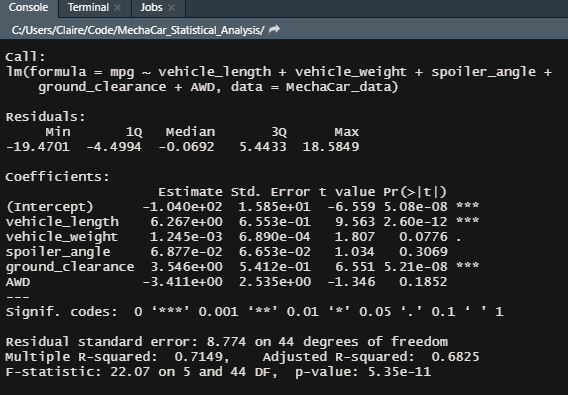
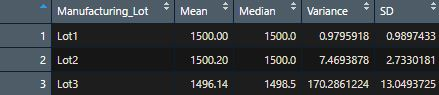
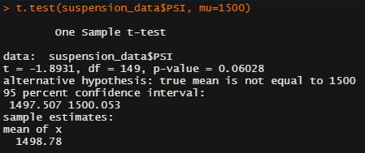
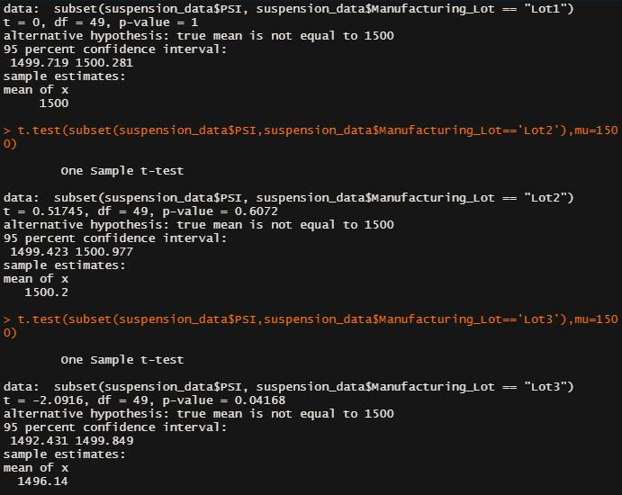

# MechaCar_Statistical_Analysis

## Linear Regression to Predict MPG

**Which variables/coefficients provided a non-random amount of variance to the mpg values in the dataset?**
The intercept, vehicle length, and ground clearance all provide a non random amount of variance. 

**Is the slope of the linear model considered to be zero? Why or why not?** The p-value is 5.08 x 10-8 which is smaller than the assumed significance level of 0.05% Therefore, there is sufficient evidence to reject our null hypothesis, meaning the slope of the linear regression is not zero.

**Does this linear model predict mpg of MechaCar prototypes effectively? Why or why not?**

The R-squared is 0.7149, meaning roughly 71% of mpg predictions using this model will be correct. While this is somewhat effective, the insignificant variables included in this value suggest overfitting, which is not ideal. 

---

## Summary Statistics on Suspension Coils
**Does the current manufacturing data meet this design specification for all manufacturing lots in total and each lot individually? Why or why not?**

Based on the total summary table created, the variance is only 62.3, which does not exceed the 100 pound per square inch variance limit. However, the summary table grouped by lot tells a different story. The variance for lots 1 and 2 are 0.97 and 7.47 respectively, which is well under the 100 pouds per square inch variance limit. Lot 3 has a variance of 170 pounds per square inch, which will well over the limit.

---

## T-Tests on Suspension Coils
### Deliverable 3 Part 1

As shown above, the p-value for this test to determine if the PSI across all manufacutring lots is statistically different from the population mean of 1,500 pounds per square inch is equal to 0.06028. The p-value is above our significance level of .05, therefore, we do not have sufficient evidence to reject the null hypothesis. The two means are statistically similar. 

---

### Deliverable 3 Part 2

Next I ran 3 different t.tests to determine if the PSI for each manufacturing lot is statistically different from the population mean of 1,500 pounds per square inch. The p-values for lots 1 and 2 are higher than the significance level of 0.05 meaning, we do not have sufficient evidence to reject the null hypothesis. The two means are statistically similar. Lot 3, however, had a p-value of 0.04168. This is below our significance level of 0.05, so we have sufficient evidence to reject the null hypothesis.Therefore, the mean lot lot 3 is statistically different than 1,500.

---

## Study Design: MechaCar vs Competition
If I were to design a statistical study of compare how MechaCar performs against their competition, I would want to look at fuel efficiency and maintenance costs so I know what expenses to expect.  

To test our fuel efficiency compared to competitors', we would need mpg data from MechaCar and their competitors. Our null hypothesis would be that there is no statistical difference between MechaCar's mpg and their competitors. The alternative hypothesis would be that the mean of MechaCar's mpg is higher than the mean of their competitors. We would use a paired t.test to compare two samples from our two different populations. If the p value from this test is less than our significance level of 0.05, we would reject the null hypothesis, meaning that MechaCar's fuel efficiency is better than the competition. 

Another factor I think would be interesting to look at is maintenance cost. I would use a multiple linear regression to see if I can predict maintenance costs based on the independent variables of horse power, fuel efficiency, and cost of the car. I would need a dataset comtaining all of this information for MechaCar and their competition. The null hypothesis would be that the slope of the linear model is zero, or m = 0, while the alternative hypothesis is that the slope of the linear model is not zero, or m ≠ 0. If our model determines there's a significant linear relationship, I will be able to determine maintenance costs for MechaCar and their competition. After that, I can determine if these costs are statistically different or not.